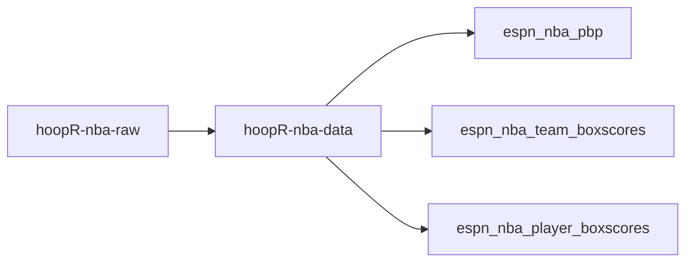
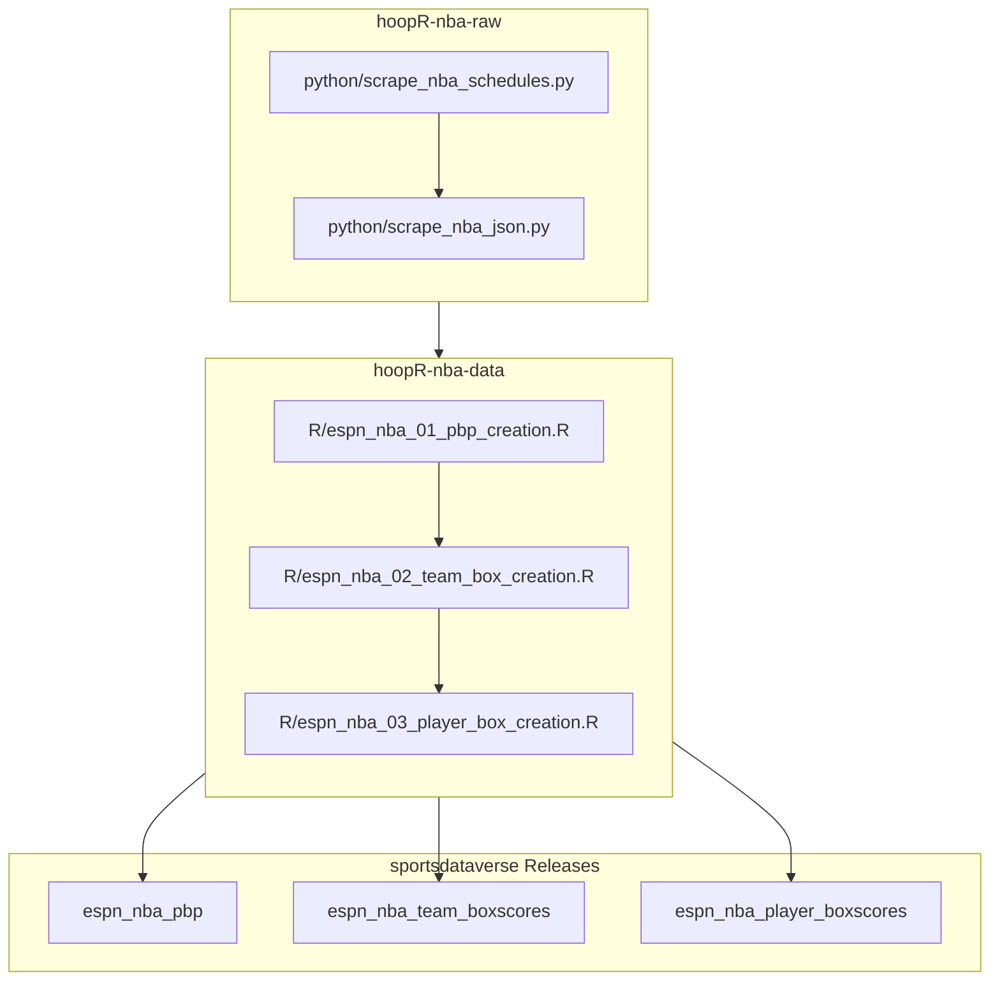

# hoopR-nba-raw

## hoopR ESPN NBA workflow diagram

[hoopR-nba-raw data repository (source: ESPN)](https://github.com/sportsdataverse/hoopR-nba-raw)

[hoopR-nba-data repository (source: ESPN)](https://github.com/sportsdataverse/hoopR-nba-data)

[hoopR-nba-stats-data Repo (source: NBA Stats)](https://github.com/sportsdataverse/hoopR-nba-stats-data)

[hoopR-mbb-raw data repository (source: ESPN)](https://github.com/sportsdataverse/hoopR-mbb-raw)

[hoopR-mbb-data repository (source: ESPN)](https://github.com/sportsdataverse/hoopR-mbb-data)

[hoopR-kp-data Repo (source: KenPom)](https://github.com/sportsdataverse/hoopR-kp-data)