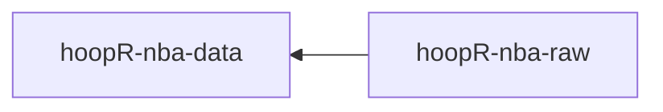

# hoopR-nba-raw

[hoopR-nba-raw data repository](https://github.com/sportsdataverse/hoopR-nba-raw)

[hoopR-nba-data repository](https://github.com/sportsdataverse/hoopR-nba-data)

[hoopR-mbb-raw data repository](https://github.com/sportsdataverse/hoopR-mbb-raw)

[hoopR-mbb-data repository](https://github.com/sportsdataverse/hoopR-mbb-data)