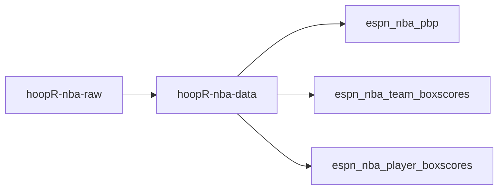
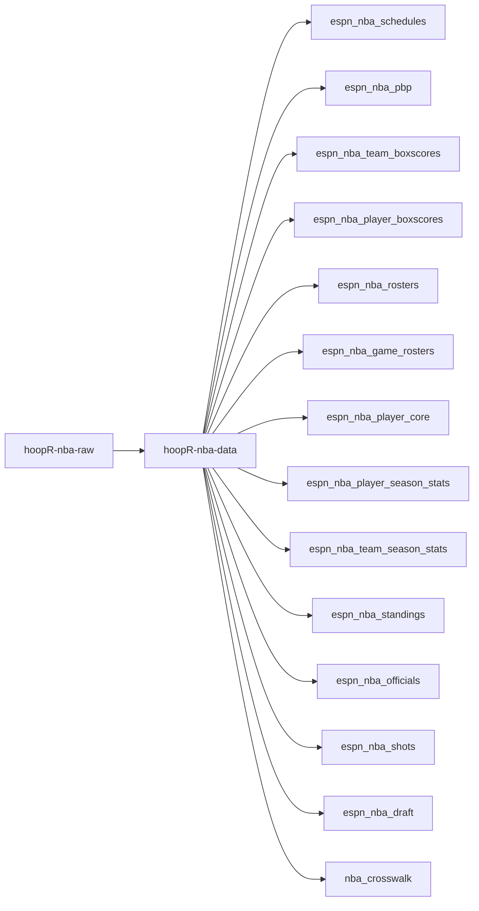
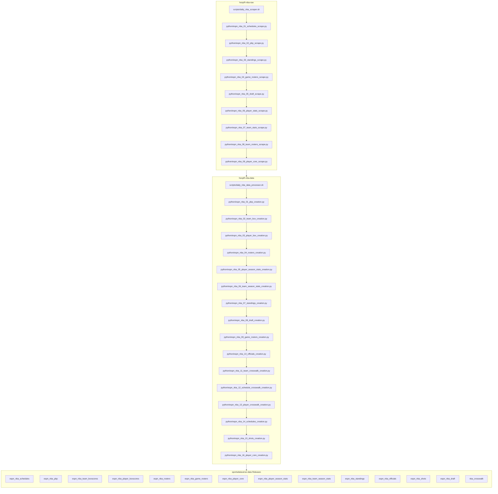

# hoopR-nba-raw

```mermaid
  graph LR;
    A[hoopR-nba-raw]-->B[hoopR-nba-data];
    B[hoopR-nba-data]-->C1[espn_nba_pbp];
    B[hoopR-nba-data]-->C2[espn_nba_team_boxscores];
    B[hoopR-nba-data]-->C3[espn_nba_player_boxscores];

```

## hoopR ESPN NBA workflow diagram

```mermaid
  graph LR;
    A[hoopR-nba-raw]-->B[hoopR-nba-data];
    B[hoopR-nba-data]-->C1[espn_nba_schedules];
    B[hoopR-nba-data]-->C2[espn_nba_pbp];
    B[hoopR-nba-data]-->C3[espn_nba_team_boxscores];
    B[hoopR-nba-data]-->C4[espn_nba_player_boxscores];
    B[hoopR-nba-data]-->C5[espn_nba_rosters];
    B[hoopR-nba-data]-->C6[espn_nba_game_rosters];
    B[hoopR-nba-data]-->C7[espn_nba_player_core];
    B[hoopR-nba-data]-->C8[espn_nba_player_season_stats];
    B[hoopR-nba-data]-->C9[espn_nba_team_season_stats];
    B[hoopR-nba-data]-->C10[espn_nba_standings];
    B[hoopR-nba-data]-->C11[espn_nba_officials];
    B[hoopR-nba-data]-->C12[espn_nba_shots];
    B[hoopR-nba-data]-->C13[espn_nba_draft];
    B[hoopR-nba-data]-->C14[nba_crosswalk];
```

```mermaid
flowchart TB;
    subgraph A[hoopR-nba-raw];
        direction TB;
        A0[scripts/daily_nba_scraper.sh]-->A1[python/espn_nba_01_schedules_scrape.py];
        A1[python/espn_nba_01_schedules_scrape.py]-->A2[python/espn_nba_02_pbp_scrape.py];
        A2[python/espn_nba_02_pbp_scrape.py]-->A3[python/espn_nba_03_standings_scrape.py];
        A3[python/espn_nba_03_standings_scrape.py]-->A4[python/espn_nba_04_game_rosters_scrape.py];
        A4[python/espn_nba_04_game_rosters_scrape.py]-->A5[python/espn_nba_05_draft_scrape.py];
        A5[python/espn_nba_05_draft_scrape.py]-->A6[python/espn_nba_06_player_stats_scrape.py];
        A6[python/espn_nba_06_player_stats_scrape.py]-->A7[python/espn_nba_07_team_stats_scrape.py];
        A7[python/espn_nba_07_team_stats_scrape.py]-->A8[python/espn_nba_08_team_rosters_scrape.py];
        A8[python/espn_nba_08_team_rosters_scrape.py]-->A9[python/espn_nba_09_player_core_scrape.py];
    end;

    subgraph B[hoopR-nba-data];
        direction TB;
        B0[scripts/daily_nba_data_processor.sh]-->B1[python/espn_nba_01_pbp_creation.py];
        B1[python/espn_nba_01_pbp_creation.py]-->B2[python/espn_nba_02_team_box_creation.py];
        B2[python/espn_nba_02_team_box_creation.py]-->B3[python/espn_nba_03_player_box_creation.py];
        B3[python/espn_nba_03_player_box_creation.py]-->B4[python/espn_nba_04_rosters_creation.py];
        B4[python/espn_nba_04_rosters_creation.py]-->B5[python/espn_nba_05_player_season_stats_creation.py];
        B5[python/espn_nba_05_player_season_stats_creation.py]-->B6[python/espn_nba_06_team_season_stats_creation.py];
        B6[python/espn_nba_06_team_season_stats_creation.py]-->B7[python/espn_nba_07_standings_creation.py];
        B7[python/espn_nba_07_standings_creation.py]-->B8[python/espn_nba_08_draft_creation.py];
        B8[python/espn_nba_08_draft_creation.py]-->B9[python/espn_nba_09_game_rosters_creation.py];
        B9[python/espn_nba_09_game_rosters_creation.py]-->B10[python/espn_nba_10_officials_creation.py];
        B10[python/espn_nba_10_officials_creation.py]-->B11[python/espn_nba_11_team_crosswalk_creation.py];
        B11[python/espn_nba_11_team_crosswalk_creation.py]-->B12[python/espn_nba_12_schedule_crosswalk_creation.py];
        B12[python/espn_nba_12_schedule_crosswalk_creation.py]-->B13[python/espn_nba_13_player_crosswalk_creation.py];
        B13[python/espn_nba_13_player_crosswalk_creation.py]-->B14[python/espn_nba_14_schedules_creation.py];
        B14[python/espn_nba_14_schedules_creation.py]-->B15[python/espn_nba_15_shots_creation.py];
        B15[python/espn_nba_15_shots_creation.py]-->B16[python/espn_nba_16_player_core_creation.py];
    end;

    subgraph C[sportsdataverse-data Releases];
        direction TB;
        C1[espn_nba_schedules];
        C2[espn_nba_pbp];
        C3[espn_nba_team_boxscores];
        C4[espn_nba_player_boxscores];
        C5[espn_nba_rosters];
        C6[espn_nba_game_rosters];
        C7[espn_nba_player_core];
        C8[espn_nba_player_season_stats];
        C9[espn_nba_team_season_stats];
        C10[espn_nba_standings];
        C11[espn_nba_officials];
        C12[espn_nba_shots];
        C13[espn_nba_draft];
        C14[nba_crosswalk];
    end;

    A-->B;
    B-->C;
```

`scripts/daily_nba_scraper.sh` and `scripts/daily_nba_data_processor.sh` are the
daily drivers (the `00` role); stage numbers are intended build order, not run order.

[hoopR-mbb-raw repository (source: ESPN)](https://github.com/sportsdataverse/hoopR-mbb-raw)

[hoopR-mbb-data repository (source: ESPN)](https://github.com/sportsdataverse/hoopR-mbb-data)

[hoopR-nba-raw repository (source: ESPN)](https://github.com/sportsdataverse/hoopR-nba-raw)

[hoopR-nba-data repository (source: ESPN)](https://github.com/sportsdataverse/hoopR-nba-data)

[hoopR-nba-stats-raw repository (source: NBA Stats)](https://github.com/sportsdataverse/hoopR-nba-stats-raw)

[hoopR-nba-stats-data repository (source: NBA Stats)](https://github.com/sportsdataverse/hoopR-nba-stats-data)

[ncaa-mbb-hoops-raw repository (source: stats.ncaa.org)](https://github.com/sportsdataverse/ncaa-mbb-hoops-raw)

[ncaa-mbb-hoops-data repository (source: stats.ncaa.org)](https://github.com/sportsdataverse/ncaa-mbb-hoops-data)

[hoopR-kp-data repository (source: KenPom, dormant)](https://github.com/sportsdataverse/hoopR-kp-data)

## Reports & explainers

<!-- BEGIN GENERATED: reports -->

| Report | What it is | Last updated |
|---|---|---|
| _none yet_ | — | — |

<!-- END GENERATED: reports -->

## Automation & status

<!-- BEGIN GENERATED: status -->

| workflow | schedule | last run |
|---|---|---|
|  | on push / PR / dispatch | 2026-08-19 |
|  | on push / PR / dispatch | 2026-08-19 |
|  | on push / dispatch | 2026-08-19 |

<!-- END GENERATED: status -->
