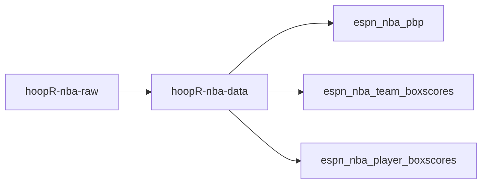
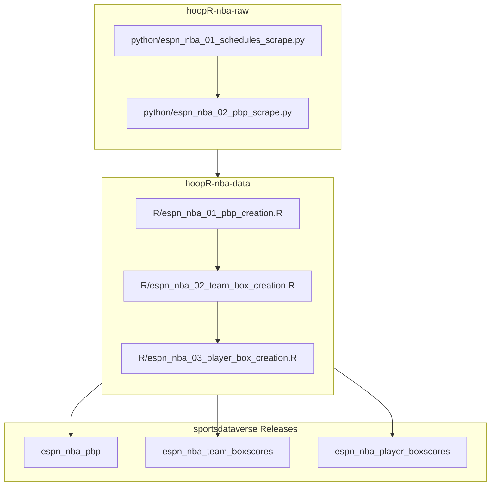

# hoopR-nba-raw

```mermaid
  graph LR;
    A[hoopR-nba-raw]-->B[hoopR-nba-data];
    B[hoopR-nba-data]-->C1[espn_nba_pbp];
    B[hoopR-nba-data]-->C2[espn_nba_team_boxscores];
    B[hoopR-nba-data]-->C3[espn_nba_player_boxscores];

```

## hoopR ESPN NBA workflow diagram

```mermaid
flowchart TB;
    subgraph A[hoopR-nba-raw];
        direction TB;
        A1[python/espn_nba_01_schedules_scrape.py]-->A2[python/espn_nba_02_pbp_scrape.py];
    end;

    subgraph B[hoopR-nba-data];
        direction TB;
        B1[R/espn_nba_01_pbp_creation.R]-->B2[R/espn_nba_02_team_box_creation.R];
        B2[R/espn_nba_02_team_box_creation.R]-->B3[R/espn_nba_03_player_box_creation.R];
    end;

    subgraph C[sportsdataverse Releases];
        direction TB;
        C1[espn_nba_pbp];
        C2[espn_nba_team_boxscores];
        C3[espn_nba_player_boxscores];
    end;

    A-->B;
    B-->C1;
    B-->C2;
    B-->C3;

```

Script numbers are run order; `scripts/daily_nba_scraper.sh` is the daily driver (the 00 role).

[hoopR-nba-raw data repository (source: ESPN)](https://github.com/sportsdataverse/hoopR-nba-raw)

[hoopR-nba-data repository (source: ESPN)](https://github.com/sportsdataverse/hoopR-nba-data)

[hoopR-nba-stats-data Repo (source: NBA Stats)](https://github.com/sportsdataverse/hoopR-nba-stats-data)

[hoopR-mbb-raw data repository (source: ESPN)](https://github.com/sportsdataverse/hoopR-mbb-raw)

[hoopR-mbb-data repository (source: ESPN)](https://github.com/sportsdataverse/hoopR-mbb-data)

[hoopR-kp-data Repo (source: KenPom)](https://github.com/sportsdataverse/hoopR-kp-data)

## Automation & status

<!-- BEGIN GENERATED: status -->

| workflow | schedule | last run |
|---|---|---|
|  | on push / PR / dispatch | 2026-08-19 |
|  | on push / PR / dispatch | 2026-08-19 |
|  | on push / dispatch | 2026-08-19 |

<!-- END GENERATED: status -->
